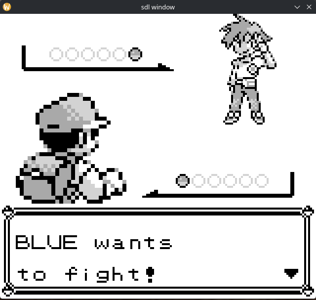

# c-dmg-emu

Inspired by my latest project, py-dmg-emu, I have decided to attempt a rewrite in C. This is both because the python version is very slow but also because I want to improve my abilities to program in C.

The emulator is currently as complete as the python one (+ some PPU tweaks).

This will probably not be updated by me for some time sadly; it is very hard for me to keep motivation for one project for a decent amount of time.

## Building

To build this do the following

```
cmake -B build
cmake --build build
```

The only dependencies should be SDLv2 and the standard requirements for building anything.

## Screenshots

